# Theory-of-Formal-Languages-and-Compilers

## <a id="lab7"></a> Лабораторная работа 7. Анализ и преобразование кода с использованием Clang и LLVM

### 1)Автор

- Выолнил -> Олейник Егор Викторович
- Группа -> АП-326

## Постановка задачи

### Общее задание
Познакомиться с инструментарием Clang и LLVM, освоить получение абстрактного синтаксического дерева (AST) и промежуточного представления (LLVM IR) для кода на C/C++, научиться применять базовые оптимизации, строить графы потока управления (CFG), а также анализировать влияние оптимизаций на различные синтаксические конструкции языка.

### Описание индивидуального задания
Выполнить анализ конкретного фрагмента кода с вещественными константами и арифметическими операциями:
1. Получить IR для `-O0`.
2. Получить IR для `-O2`. Проверить, произошло ли свёртывание константы.
3. Применить проходы `-constprop`, `-globalopt`, `-ipsccp`.
4. Сравнить CFG.
5. Сделать вывод о том, когда вещественная константа вычисляется на этапе компиляции.

## Общее задание

### Установка среды
Установить Clang, LLVM, opt и Graphviz

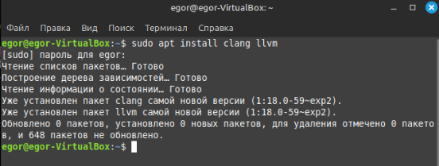

Рисунок 1 - Установка 

### Исходный код

Исходный код:

```
#include <stdio.h>
int square(int x) {
 return x * x;
}
int main() {
 int a = 5;
 int b = square(a);
 printf("%d\n", b);
 return 0;
}
```

### Работа с AST
Для получения дерева используется флаг `-ast-dump`. Результат показывает иерархию синтаксических 
конструкций: объявления функций, переменных, операторов и выражений.

```
clang -Xclang -ast-dump -fsyntax-only main.c
```

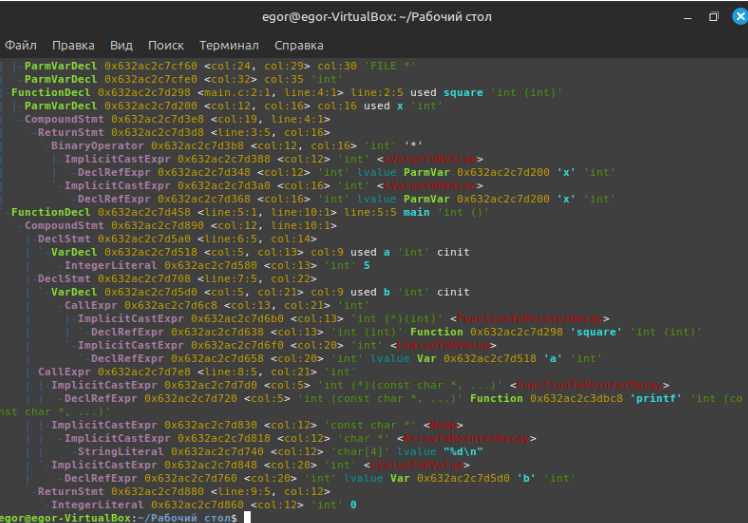
  
  Рисунок 4 - Результат

### Генерация LLVM IR
Генерация выполняется командами:

```
clang -S -emit-llvm main.c -o main.ll
```
Получаем main.ll

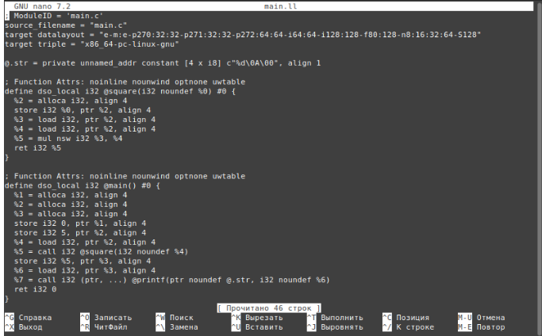
 
 Рисунок 5 - main.ll

### Оптимизация IR
Оптимизация выполняется командами:

```
clang -S -emit-llvm -O0 main.c -o main_O0.ll
clang -S -emit-llvm -O2 main.c -o main_O2.ll
```

В режиме -O0 IR сохраняет прямое соответствие исходному коду: используются alloca, load, store.

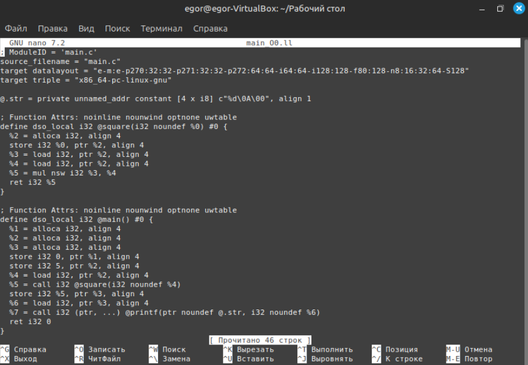
 
 Рисунок 6 - main_O0.ll

В режиме -O2 применяется SSA-форма, переменные размещаются в виртуальных регистрах, устраняются избыточные обращения к памяти.

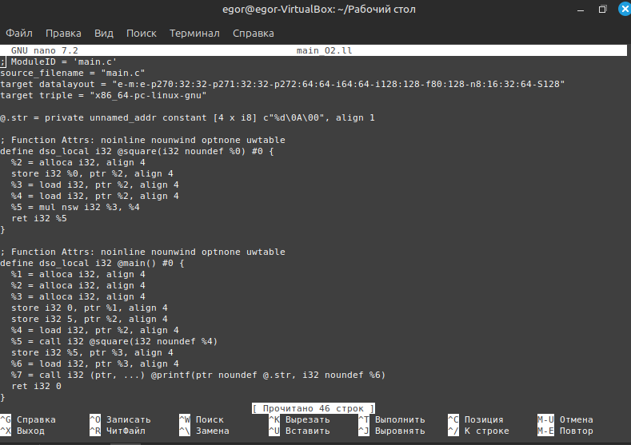
 
 Рисунок 7 - main_O2.ll

### Построение CFG

Команда для генерации оптимизированного LLVM IR: clang -O2 -S

```
clang -O2 -S -emit-llvm main.c -o main.ll

```
Команда для генерации .dot-файлов CFG для функций: opt -dot-cfg

```
opt -passes="dot-cfg" main.ll -disable-output
```

Далее смотрим .dot файл командой 
```
find . -name "*.dot"
```

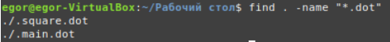
 
 Рисунок 8 - .dot


С помощью команды для преобразования файлов с расширением .dot в .png с
помощью Graphviz:

```
dot -Tpng .main.dot -o cfg_main.png
dot -Tpng .square.dot -o cfg_square.png
```

И просматриаваем с помощью команды для просмотра файлов с CGF:

```
xdg-open cfg_main.png
```

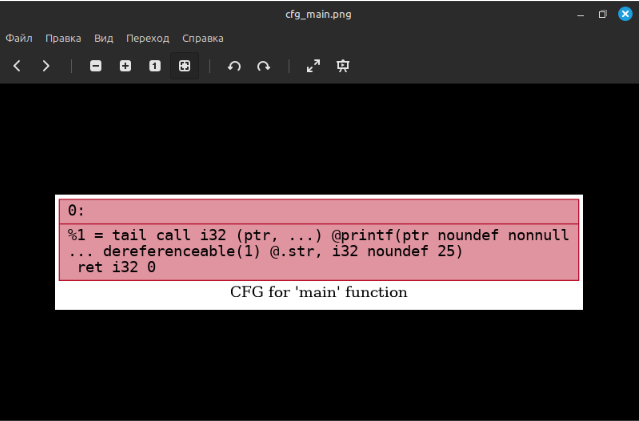

  Рисунок 9 - cfg_main.png

```
xdg-open cfg_square.png
```

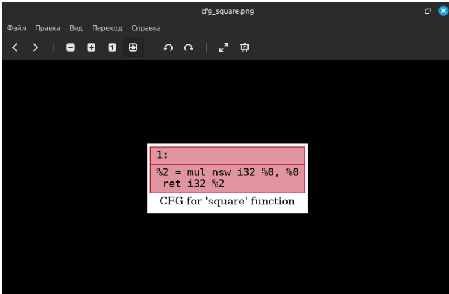

  Рисунок 10 - cfg_square.png

### Индивидуальное задание
Выполнение анализа конкретной синтаксической конструкции
Исходный код:

```
const double PI = 3.141592653589793;

int main() {
    double r = 2.0;
    double area = PI * r * r;
    return (int)area;
}
```

##### 1. IR для -O0
Команда:

```
clang -S -emit-llvm -O0 -o ir_O0.ll main.c
```

Создаёт файл ir_O0.ll с читаемым LLVM IR. Флаг -O0 отключает все оптимизации.

Проверяем:

```
grep -A 12 "define.*main" ir_O0.ll
```

Вывод:

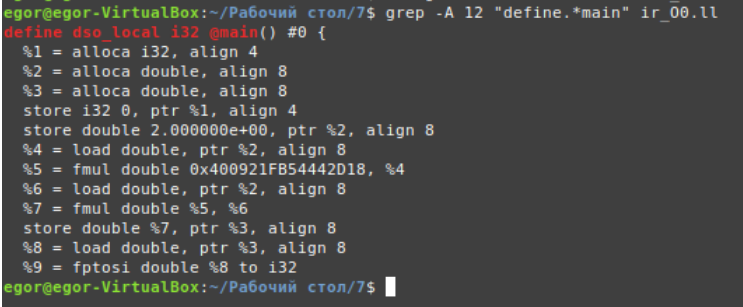

  Рисунок 10 - Вывод задание 1

Значение: 
Компилятор буквально транслирует каждую строку C в инструкции работы 
с памятью (alloca/load/store) и арифметику (fmul).

#### 2. IR для -O2. Произошло ли свёртывание константы?

-O2 включает стандартный набор оптимизаций: instcombine, constprop, sccp, dce, gvn и др.
Остальные флаги аналогичны пункту 1.

Команды:

```
clang -S -emit-llvm -O2 -o ir_O2.ll main.c
sed -n '/define.*main/,/^}/p' ir_O2.ll
```

Вывод:

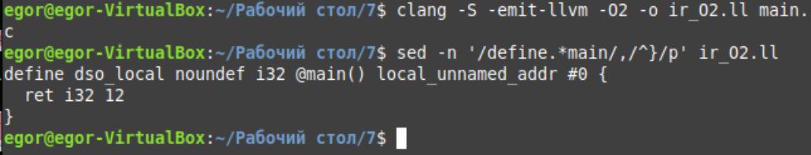

Рисунок 11 - Вывод задание 2

Да, свёртывание константы произошло. Компилятор статически вычислил значение выражения:
3.141592653589793 * 2.0 * 2.0 ≈ 12.566370614359172
Затем применил правило приведения double в int из стандарта C
(отбрасывание дробной части) и получил 12. 
Вся цепочка инструкций работы с памятью и вещественной арифметики удалена,
в IR осталась только команда ret i32 12. Вычисление выполнено на этапе компиляции.


#### 3. Применение -constprop, -globalopt, -ipsccp

* opt – инструмент LLVM для применения проходов оптимизации к готовому IR.
* -S – вывести результат в человекочитаемом .ll.
* -passes="..." – конвейер проходов (New Pass Manager, LLVM ≥13).
* globalopt – оптимизирует глобальные переменные: превращает const double PI в внутреннюю LLVM-константу.
* constprop – простое распространение констант внутри базовых блоков.
* sccp – замена ipsccp. В LLVM 12+ ipsccp удалён, его функционал полностью вошёл в sccp. Отслеживает потоки данных между блоками и подставляет известные значения.
* instcombine – объединяет и упрощает инструкции. Именно он выполняет финальную арифметику и преобразование типа.

Команды:

```
opt -S -passes="globalopt" ir_O0.ll -o ir_step1.ll

opt -S -passes="sccp,instcombine" ir_step1.ll -o ir_manual.ll

sed -n '/define.*main/,/^}/p' ir_manual.ll
```

Вывод:

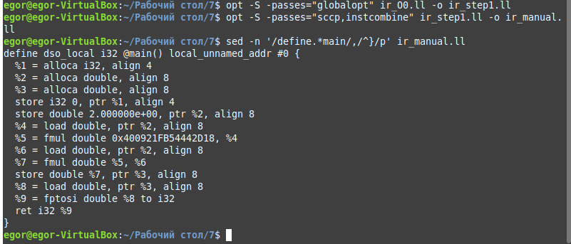

Рисунок 12 - Вывод задание 3

Ручной запуск проходов на неоптимизированном IR дал результат, идентичный -O2. 
Это доказывает, что свёртывание констант – не единый шаг, а цепочка взаимодополняющих трансформаций:
globalopt делает глобальные const доступными для анализа, sccp/constprop распространяют 
их значения по графу, а instcombine выполняет арифметическое вычисление и удаление мёртвого кода. 
Без любого из этих звеньев статическое вычисление не произойдёт.

#### 4. Сравнение CFG

opt -passes="dot-cfg" – создаёт файл cfg.<func_name>.dot с описанием Control Flow Graph (CFG).
mv – переименовывает, чтобы второй запуск не перезаписал первый.
dot – утилита из пакета Graphviz, рисует граф из .dot в картинку.

Команды:

```
mv .main.dot cfg_O0.dot
opt -passes="dot-cfg" ir_O2.ll -o /dev/null
mv .main.dot cfg_O2.dot
dot -Tpng cfg_O0.dot -o cfg_O0.png
dot -Tpng cfg_O2.dot -o cfg_O2.png

ls -l *.dot *.png
```

Результат выполнения команд:

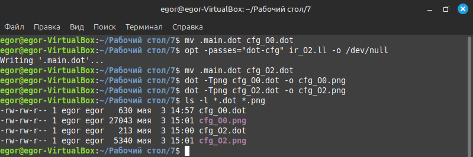

Рисунок 13 - Успешное выполнения команд задание 4

Сравнение CFG:

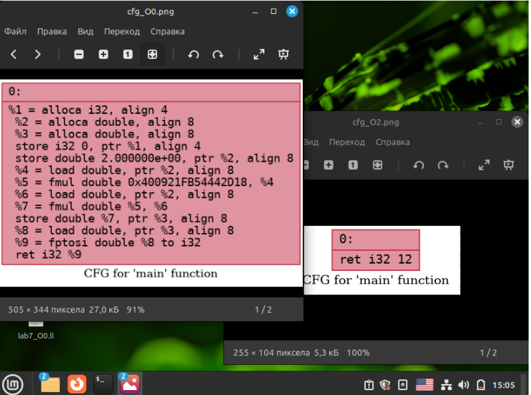

Рисунок 14 - Сравнение CFG задание 4

cfg_O0.png - Один узел entry, внутри ~13 инструкций (alloca, load, fmul, store, fptosi, ret)
cfg_O2.png - Один узел entry, внутри 1 инструкция ret i32 12


#### Задача 5. Вывод: когда вещественная константа вычисляется на этапе компиляции?

Вещественное выражение вычисляется на этапе компиляции только при одновременном выполнении трёх условий:

* 1)Все операнды статически детерминируемы. В примере это литерал 2.0 и глобальная const double PI. 
При -O0 LLVM трактует PI как переменную в памяти, но проходы globalopt и sccp (включённые при -O1+) 
доказывают её неизменность и переводят в разряд compile-time constants.

* 2)Активны проходы анализа данных и свёртки инструкций. При -O0 LLVM намеренно отключает constant folding,
чтобы сохранить пошаговую отладку и строгую семантику IEEE-754. При -O1/-O2 автоматически запускаются constprop,
sccp, instcombine, которые подставляют известные значения, вычисляют fmul и заменяют fptosi на целочисленный литерал.

* 3)Операция семантически безопасна для статического вычисления. 
Базовая арифметика (+ - * /) и приведение типов сворачиваются всегда. 
Трансцендентные функции (sin, sqrt, log) часто требуют флага -ffast-math, так как их точность и поведение могут
зависеть от runtime-библиотеки и режима округления процессора.

Экспериментальное подтверждение: в ir_O0.ll присутствуют инструкции fmul и fptosi  вычисление отложено в рантайм.
В ir_O2.ll и ir_manual.ll остаётся только ret i32 12 → значение вычислено компилятором.
Сравнение CFG показывает, что оптимизации не меняют поток управления, но схлопывают вычислительную сложность до константы.
Следовательно, compile-time evaluation для double происходит исключительно при включённых оптимизационных проходах 
и полной статической определённости операндов.

### Ответы на контрольные вопросы.

*1. Что такое Clang, и какова его роль в процессе компиляции программ?*

Clang — это компилятор для языков C, C++ и Objective-C.
Он преобразует исходный код в промежуточное представление LLVM IR. 
Clang выполняет лексический и синтаксический анализ, строит AST, проверяет типы и
генерирует код для дальнейшей обработки LLVM.

*2. Что представляет собой LLVM и как он используется в современных компиляторах?*

LLVM — это набор инструментов для компиляции, оптимизации и генерации машинного кода.
Он работает с промежуточным представлением (IR), применяет оптимизации и генерирует код для разных архитектур.
LLVM используется как бэкенд для компиляторов Clang, Rust, Swift и других.

*3. Чем отличается абстрактное синтаксическое дерево (AST) от промежуточного представления LLVM IR?*

AST отражает синтаксическую структуру исходного кода: иерархию операторов, выражений и объявлений. 
LLVM IR — это низкоуровневое представление в форме трёхадресного кода с явными операциями загрузки, сохранения и вычислений. 
AST используется для анализа кода, IR — для оптимизации и генерации машинного кода.

*4. Для чего необходимо промежуточное представление (IR) в процессе компиляции?*

IR позволяет выполнять оптимизации независимо от исходного языка и целевой архитектуры.
На уровне IR применяются преобразования кода, анализ потока данных, устранение избыточных вычислений.
Один и тот же IR может быть скомпилирован под разные платформы.

*5. Что делает инструкция alloca в LLVM IR, и зачем она используется в функциях?*

Инструкция alloca выделяет память в стеке для локальной переменной.
Она возвращает указатель на выделенную область. Используется для размещения переменных, адрес которых берётся, 
или когда переменная не может быть размещена в регистре.

*6. Зачем нужна оптимизация кода в компиляторе, и какие основные цели она преследует?*

Оптимизация улучшает характеристики скомпилированной программы.
Цели: уменьшение времени выполнения, снижение потребления памяти, уменьшение размера кода, 
снижение энергопотребления. Оптимизации удаляют мёртвый код,
объединяют инструкции, раскрывают циклы, встраивают функции.

*7. Что такое SSA-форма и почему она важна при оптимизации программ?*

SSA (Static Single Assignment) — форма представления, в которой каждая переменная назначается ровно один раз.
Новые версии переменных создаются при каждом присваивании. SSA упрощает анализ потока данных,
позволяет точно отслеживать определения и использования переменных, что необходимо для многих оптимизаций.

*8. Что такое граф потока управления (CFG) и как он помогает анализировать поведение программы?*

CFG — ориентированный граф, вершины которого соответствуют базовым блокам кода, 
а рёбра — возможным переходам между ними. CFG показывает порядок выполнения операторов, точки ветвления, циклы. 
Используется для анализа достижимости, оптимизации переходов, размещения кода.

*9. Как устроено представление арифметических операций в LLVM IR (например, умножение, сложение)?*

Арифметические операции в IR представляются отдельными инструкциями: add для сложения, 
mul для умножения, sub для вычитания. Каждая инструкция имеет тип операндов (например, i32 для 32-битных целых), 
принимает два операнда и возвращает результат. Операции выполняются в явном порядке, результат сохраняется
во временную переменную.

*10. Почему функции в LLVM IR обычно представляют собой отдельные единицы анализа и оптимизации?*

Функция в IR имеет чёткие границы: входные параметры, локальные переменные, точки возврата. 
Это позволяет анализировать и оптимизировать функцию независимо от остальной программы.
Оптимизации внутри функции не требуют анализа всего кода, что снижает сложность и ускоряет компиляцию.
 
*11. Что происходит с функцией в LLVM IR, если она вызывается один раз и очень короткая?*

Такая функция может быть встроена (inlined) в место вызова. 
Код функции копируется напрямую, устраняется накладная стоимость вызова. 
После встраивания становятся доступны дополнительные оптимизации: свёртка констант, 
удаление мёртвого кода, упрощение выражений.

*12. Какие преимущества даёт использование IR и CFG для автоматических оптимизаций по сравнению с анализом исходного текста на C?*

IR имеет однозначную структуру, явные типы и операции, форму SSA. 
Это упрощает анализ зависимостей, поток данных, обнаружение избыточных вычислений.
CFG предоставляет явную модель управления, что позволяет анализировать пути выполнения, 
оптимизировать ветвления и циклы. Исходный код на C содержит синтаксические детали, 
неявные преобразования и конструкции высокого уровня, которые затрудняют автоматический анализ.

## _Дополнительное задание. Локальные оптимизации синтаксических конструкций на промежуточном представлении_

### 1)Построить абстрактное синтаксическое дерево (AST) конструкции

Моя конструкция: 

```
final double PI = 3.14;
```


Рисунок AST:

```
ProgramNode
\- FinalDoubleDeclarationNode
   +- modifiers: ["final"]
   +- type: TypeNode
   |  \- name: "double"
   +- name: "PI"
   \- value: NumberLiteralNode
      \- value: 3.14
```


### 2)Сгенерировать промежуточное представление (IR) для данной конструкции в виде трехадресного кода (TAC) или списка виртуальных инструкций или канонической строковой формы (упрощённый вариант для одной строки).

Для демонстрации оптимизаций в соответствии с требованием (свёртка констант) возьмём эквивалентную запись 
с арифметическим выражением: `final double PI = 3.0 + 0.14;`

Исходный TAC (до оптимизаций):

```
t0 = 3.0 + 0.14
t1 = t0
PI = t1
```

Результат = операнд1 op операнд2 или результат = значение (строковая форма TAC)

### 3)Реализовать две локальные оптимизации. Каждая оптимизация должна преобразовывать IR к эквивалентному, но более простому или каноническому виду.

#### Оптимизация 1: Свёртка констант (Constant Folding)
Преобразование вычисляет арифметические выражения, состоящие исключительно из литералов,
на этапе компиляции. Это обязательная оптимизация для константных выражений. Семантика сохраняется:
результат вычисления остаётся идентичным, но устраняется операция сложения времени выполнения.

Блок-схема реализации:

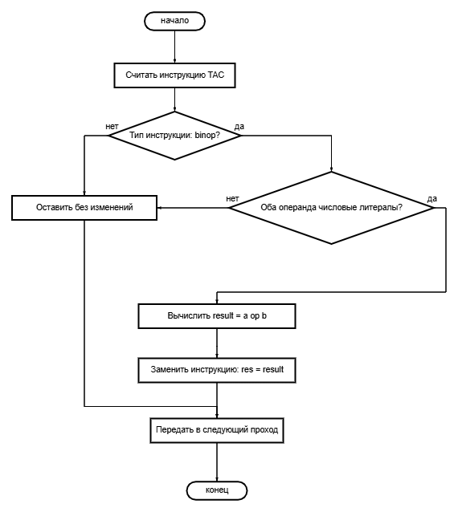

Рисунок 15 - Блок схема для 1 оптимизации

Демонстрация:

| Входной IR | Выходной IR |
|:---:|:---|
| `t0 = 3.0 + 0.14` | `PI = t1` |
| `t1 = t0` | `t1 = t0` | 
| `PI = t1` | `PI = t1` | 

#### Оптимизация 2: Распространение копий / Удаление мёртвого кода (Copy Propagation & DCE)

Если временная переменная получает значение без промежуточных вычислений (t1 = t0),
все её использования заменяются на источник. Если после подстановки переменная не используется, 
инструкция удаляется. Это канонизирует IR до минимальной формы PI = 3.14, удаляя избыточные регистры t0, t1.
Локальность гарантируется: анализ не выходит за пределы блока объявления.

Блок-схема реализации:

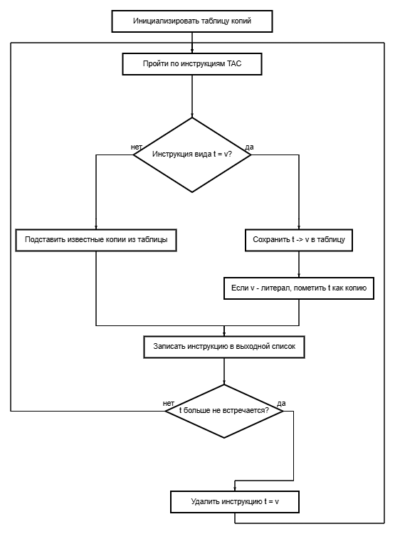

Рисунок 16 - Блок схема для 2 оптимизации

Демонстрация:

| Входной IR | Выходной IR |
|:---:|:---|
| `t0 = 3.14`| `(удалено: t0 не используется явно)` |
| `t1 = t0` | `(удалено: подставлено в PI)` | 
| `PI = t1` | `PI = 3.14` | 

### 4)Продемонстрировать работу оптимизаций на конкретных примерах: показать «входной IR» и «выходной IR» после применения каждой оптимизации.

Далее тесты на примере выражения `final double PI = 3.0 + 0.14;`

Генерация TAC 

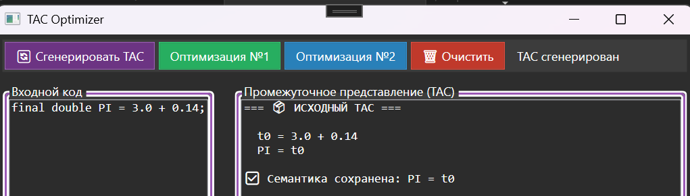

Рисунок 17 - Генерация TAC 

Оптимизация №1

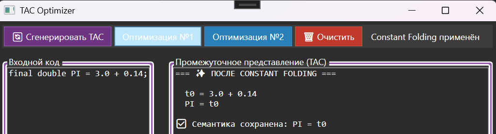

Рисунок 18 - Оптимизация №1

Оптимизация №2

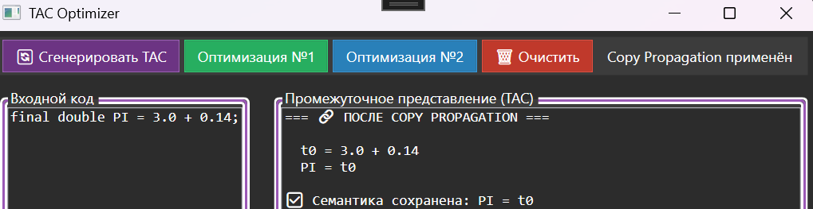

Рисунок 19 - Оптимизация №2

Ошибка (Если просить оптимизацию без генерации TAC)


Рисунок 20 - Ошибка