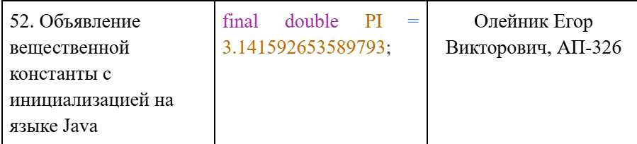
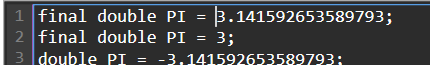
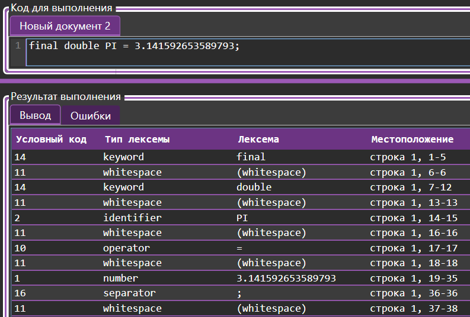
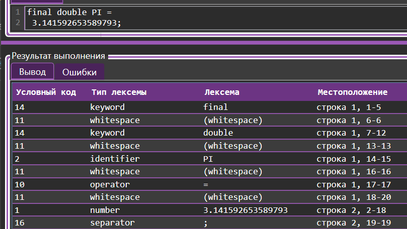
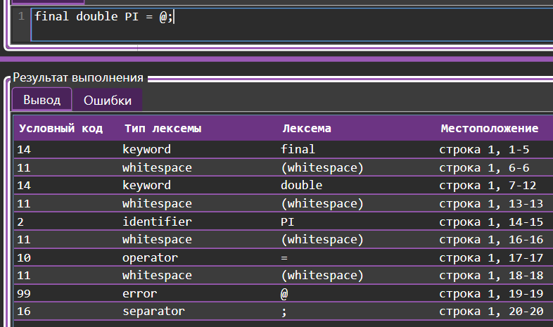

# Theory-of-Formal-Languages-and-Compilers
## Список выполненных работ

- [Лабораторная работа 1.](#lab1)
- [Лабораторная работа 2.](#lab2)
- [Лабораторная работа 3.](#lab3)
- [Лабораторная работа 4.](#lab4)
- [Лабораторная работа 5.](#lab5)

## <a id="lab1"></a> Лабораторная работа 1. Разработка пользовательского интерфейса (GUI) для языкового процессора
### 1) Цель работы.
Создание кроссплатформенного графического интерфейса (GUI) для языкового процессора в виде специализированного текстового редактора.

### 2) Сведения об авторе.
- Выолнил -> Олейник Егор Викторович 
- Группа -> АП-326

### 3) Описание проекта: краткое описание реализованного приложения.
Приложение представляет собой текстовый редактор с разделённым интерфейсом, предназначенный для написания, редактирования и тестирования программного кода и имеет следующие ключевые особенности:

1. Тёмная фиолетовая тема оформления с кастомными стилями
2. Две основные области: редактор кода и панель вывода результатов
3. Отображение ошибок в виде структурированной таблицы
4. Статус-бар с информацией о позиции курсора, состоянии сохранения
5. Поддержка переключения языка интерфейса (русский/английский)
6. Полная поддержка горячих клавиш для основных операций

### 5) Используемые технологии: язык программирования, фреймворк для GUI , среда разработки.
| Компонент | Технология / Версия |
|-----------|---------------------|
| **Язык программирования** | C# |
| **GUI-фреймворк** | WPF (Windows Presentation Foundation) |
| **Платформа** | .NET |
| **Среда разработки** | Microsoft Visual Studio 2022 |
| **Система сборки** | MSBuild |

### 6) Инструкция по сборке и запуску:
#### Требования к системе
- ОС: Windows 10/11 (x64)
- Установленный .NET 6.0 Desktop Runtime или .NET Framework 4.7.2+
- Не менее 512 МБ свободной оперативной памяти

#### Установка зависимостей
- Установите **Visual Studio 2022** 
   [Скачать Visual Studio](https://visualstudio.microsoft.com/ru/downloads/)

#### Сборка проекта

##### 1. Часть
- Откройте файл решения
- Выберите конфигурацию
- Соберите проект

##### 2. Чачсь
Далее что бы самостоятельное преобразовать проект в один уневерсальный .exe файл необходимо следовать командам (см. Рисунок 1)

 Рисунок 1 - Успешное преобразование
### 7) Путь к готовому исполняемому файлу.
- Далее ссылка для скачивания готового проекта
  [Скачать исполняемый файл](https://github.com/egorabs323/Theory-of-Formal-Languages-and-Compilers/releases/download/1лаб/laba1.zip)
  
### 8) Описание интерфейса и функций (руководство пользователя)

#### Главный экран. Это начнальное окно на котором мы можем видеть все ключевые рабочие функции приложения (см. Рисунок 2)

 Рисунок 2 - Главынй экран 

 #### Вкладка Файл. Тут находятся все инструменты для работы с файлом (см. Рисунок 3)

 Рисунок 3 - Файл

 #### Вкладка Правка. Содержит все необходимые инструменты для работы с текстом (см. Рисунок 4)

 Рисунок 4 - Правка

 #### Вкладка Справка. Сопроводительная информация к проекту имеет "руководство пользователя" и "о программе" (см. Рисунок 5)

 Рисунок 5 - Справка

#### Вкладка Вид. Инструмент для изменения размера текста (см. Рисунок 6)

 Рисунок 6 - Вид

#### Вкладка Язык. Имеется русская и английская локализация приложения (см. Рисунок 7)

 Рисунок 7 - Язык

 Рисунок 8 - Английская локализация

#### Панель инстурментов. В ней содержится тот же функционал что описанн ранее. Служит для быстрого доступа к функциям (см. Рисунок 9)

 Рисунок 9 - Панель инструментов

### Окно Результат выполнения. В нем расположены два подокна "Вывод " и " Ошибка" (см. Рисунок 10)
 
 Рисунок 10 - Реезульат выполнения

## <a id="lab2"></a> Лабораторная работа 2. Разработка лексического анализатора (сканера)

### 1)Цель работы.
Изучить назначение и принципы работы лексического анализатора в структуре компилятора. Спроектировать алгоритм (диаграмму состояний) и выполнить программную реализацию сканера для выделения лексем из входного текста. Интегрировать разработанный модуль в ранее созданный графический интерфейс языкового процессора.

### 2)Постановка задачи.
Разработать лексический анализатор (сканер) в соответствии с индивидуальным вариантом задания, интегрировать его в приложение из лабораторной работы №1 и обеспечить наглядный вывод результатов.

### 3)Сведения об авторе.
- Выолнил -> Олейник Егор Викторович 
- Группа -> АП-326

### 4) Путь к готовому исполняемому файлу.
- Далее ссылка для скачивания готового проекта
  [Скачать исполняемый файл](https://github.com/egorabs323/Theory-of-Formal-Languages-and-Compilers/releases/download/2лаб/laba1.exe)
  
### 5)Вариант задания.

#### 5.1.Номер варианта, его текстовое описание.

- Вещенственные константы 
- Вариант РГР №52 Объявление вещественной константы с инициализацией на языке Java

#### 5.2.Примеры корректных входных строк



Рисунок 1 - Пример входных строк

#### 5.3.Перечень допустимых лексем.

- "LETTER"
- "DIGIT"
- "WHITESPACE"
- "+"
- "-"
- "="
- ";"

### 6)Диаграмма состояний.


Рисунок 2 - Диаграмма состояний

### 7)Тестовые примеры.



Рисунок 3 - Тест №1



Рисунок 4 - Тест №2



Рисунок 5 - Тест №3


## <a id="lab3"></a> Лабораторная работа 3. Разработка синтаксического анализатора (парсера)

### 1) Цель работы.


- Изучить назначение и принципы работы синтаксического анализатора в структуре компилятора. Спроектировать грамматику, построить соответствующую схему метода анализа грамматики и выполнить программную реализацию парсера с нейтрализацией синтаксических ошибок методом Айронса. Интегрировать разработанный модуль в ранее созданный графический интерфейс языкового процессора.

- Разработать синтаксический анализатор (парсер) в соответствии с индивидуальным вариантом курсовой (расчетно-графической) работы, интегрировать его в приложение из лабораторной работы №1 и обеспечить наглядный вывод результатов анализа.

### 2) Сведения об авторе.
- Выолнил -> Олейник Егор Викторович 
- Группа -> АП-326

### 3)Вариант задания.
#### 3.1.Номер варианта, его текстовое описание.

- Вещенственные константы 
- Вариант РГР №52 Объявление вещественной константы с инициализацией на языке Java

#### 3.2.Примеры корректных входных строк


Рисунок 1 - Пример входных строк

#### 3.3.Перечень допустимых лексем.

- "LETTER"
- "DIGIT"
- "WHITESPACE"
- "+"
- "-"
- "="
- ";"

### 4) Разработка грамматики.


Рисунок 2 - Граматика согласно варианта

### 5) Классификация грамматики (по Хомскому).

Формула автоматной граматики: Z -> aA | b | ε 
Данная граматика являктся автоматной, это самый ограниченный класс грамматик по Хомскому.  
Языки, порождаемые такими грамматиками, называются регулярными языками.


### 6) Метод анализа.

Далее представлен граф автоматной граматики 


Рисунок 3 - Граф автоматной граматики 

### 7) Диагностика и нейтрализация синтаксических ошибок.

По требованиям к выполнению лабораторной требуется использовать метод Айронса.
Основная идея – по контексту без возврата отбрасывать литеры,
которые привели к тупиковой ситуации, и продолжать разбор. 

Программа заранее хранит готовые шаблоны правильных команд. Когда программа читает код,
она по очереди сравнивает полученные слова с этими шаблонами и ищет самый лёгкий путь к исправлению. 
Если чего-то не хватает или запись числа выглядит странно, программа просто записывает в отчёт понятную подсказку,
например «Ожидалось число» или «Неверный формат числа»
Разбор идёт строго по одной строке кода до точки с запятой, поэтому ошибка в одном месте не мешает читать остальные строки. 
В итоге она спокойно продолжает работу до самого конца файла.

### 8) Тестовые примеры.


Рисунок 4 - Успешный пример


Рисунок 6 - Неуспешный пример №1


Рисунок 7 - Неуспешный пример №2

## <a id="lab4"></a> Лабораторная работа 4. Реализация алгоритма поиска подстрок с помощью регулярных выражений

### 1) Цель работы.
Изучить теоретические основы регулярных выражений и их применение для поиска и извлечения подстрок из текста. 
Освоить практические навыки использования библиотечных средств работы с регулярными выражениями, 
а также интеграцию алгоритмов поиска в графический интерфейс приложения.

### 2) Сведения об авторе.
- Выолнил -> Олейник Егор Викторович 
- Группа -> АП-326

### 3)Постановка задачи.
Разработать модуль поиска подстрок с использованием регулярных выражений, 
интегрировать его в существующее приложение (текстовый редактор) 
и обеспечить наглядный вывод результатов.

#### Задания согласно варианту:

- 10) Построить РВ для того, чтобы сопоставить все слова, которые начинаются на букву m или M.
- 11) Построить РВ, описывающее Ethereum-адрес.
- 19) Построить РВ, описывающее HTML-тег с атрибутами.

### Решение 3 задач (регулярные выражения):

#### Задача 10) (1 Часть)

- Описание задачи;
  
 Регулярное выражение для поиска слов, начинающихся на m/M.

- Регулярное выражение с пояснением каждого обозначения.

   #### \b[mM][a-zA-Z]*\b

| Обозначение | Пояснение |
|-----------|---------------------|
| **\b** | Граница слова (начало) |
| **[mM]** | Первая буква: m или M |
| **[a-zA-Z]*** | Буквы |
| **\b** | Граница слова (конец) |

- Примеры строк, которые должны находиться;

| Текст | Найденные слова |
|-----------|---------------------|
| **Mimimi MI** | Mimimi MI |
| **moon UBU** | moon |
| **m1** | m |

- Примеры строк, которые не должны находиться;

| Текст | Найденные слова |
|-----------|---------------------|
| **banana** | Нет слов на m/M |
| **123M** | Слово начинается с цифры |

- Тестовые примеры.
  


Рисунок 1 - Тестовые примеры для 10 задания

#### Задача 11) (2 Часть)

- Описание задачи;
  
Построить РВ, описывающее Ethereum-адрес.
  
- Регулярное выражение с пояснением каждого обозначения.
  #### 0x[a-fA-F0-9]{40}
  
| Обозначение | Пояснение |
|-----------|---------------------|
| **0x** | Обязательный префикс |
| **[a-fA-F0-9]** | Один шестнадцатеричный символ |
| **{40}** | 40 символов |

- Примеры строк, которые должны находиться;

| Текст | Найденные слова |
|-----------|---------------------|
| **0x742d35Cc6634C0532925a3b844Bc9e7595f8fE00** | Весь адрес |
| **0x5aAeb6053F3E94C9b9A09f33669435E7Ef1BeAed** | Весь адрес |

- Примеры строк, которые не должны находиться;

| Текст | Найденные слова |
|-----------|---------------------|
| **0x123** | Слишком короткий (всего 3 символа после 0x) |
| **1x742d35Cc6634C0532925a3b844Bc9e7595f8fE00** | Префикс 1x вместо 0x |
| **742d35Cc6634C0532925a3b844Bc9e7595f8fE00** | Нет префикса 0x |

- Тестовые примеры.


Рисунок 2 - Тестовые примеры для 11 задания

#### Задача 19) (3 Часть)

- Описание задачи;

Построить РВ, описывающее HTML-тег с атрибутами.

- Регулярное выражение с пояснением каждого обозначения.

#### <[a-zA-Z][a-zA-Z0-9]*\s[^>]+>

| Обозначение | Пояснение |
|-----------|---------------------|
| **<** | Открывающая скобка тега |
| **[a-zA-Z]** | Первая буква тега|
| **[a-zA-Z0-9]*** | Остальные буквы |
| **\s** | Обязательный пробел |
| **[^>]+** | Один или более символов до > |
| **\s** | Закрывающая скобка тега |

- Примеры строк, которые должны находиться;

| Текст | Найденные слова |
|-----------|---------------------|
| **<iмg src="pic.jpg" alt="Test"/>** | Весь тег |
| **<а href="https://example.com" class="link">** | Весь тег |
| **<div id="main" сlass="abx">** | Весь тег |

- Примеры строк, которые не должны находиться;

| Текст | Найденные слова |
|-----------|---------------------|
| **div** | Нет атрибутов |
| **br** | Нет атрибутов |

- Тестовые примеры.


Рисунок 3 - Тестовые примеры для 19 задания

### 4) Дополнительное задание.

Граф автомата и тестовыми примерами поиска подстрок с указанием местоположения.


Рисунок 4 - Дополнительное задания

## <a id="lab5"></a> Лабораторная работа 5. Построение AST и проверка контекстно-зависимых условий

### 1)Автор

- Выолнил -> Олейник Егор Викторович
- Группа -> АП-326


### 2)Вариант задания

Тема работы: реализация семантического анализатора для конструкции объявления вешественной константы.

**Мой вариант:**

```
final double PI = 3.14;
```

**Примеры корректных строк:**

```
final double PI = 3.14;
final double D = 2.718;
final double p = 9.81;
```

## 3)Контекстно-зависимые условия

В программе реализованы следующие семантические проверки:

### 3.1 Уникальность имён

Идентификатор не должен быть объявлен повторно в одной области видимости.

**Пример:**

```
final double PI = 3.14;
final double PI = 2.71;
```

**Ожидаемое сообщение:**

```
Ошибка: идентификатор "PI" 
уже объявлен ранее (строка 1)

```

Статус - Выполнено 😎🤙

### 3.2 Совместимость типов

Тип значения должен соответствовать объявленному типу.

**Пример:**

```
final double PI = text;
```

**Ожидаемое сообщение:**

```
Ошибка: Ожидалось число

```

Статус - Выполнено 😎🤙

### 3.3 Допустимые значения

Значение должно находиться в допустимых пределах типа `double`.

**Пример:**

```
final double PI = 1.3e999;
```

**Ожидаемое сообщение:**

```
Ошибка: значение выходит за 
допустимый диапазон для типа double
```

Статус - Выполнено 😎🤙

### 4)Структура AST

#### a. Типы узлов:

* **ConstDeclNode** — объявление константы
  Атрибуты: имя, модификаторы, тип, значение

* **TypeNode** — тип данных
  Атрибуты: имя типа

* **FloatLiteralNode** — числовой литерал
  Атрибуты: значение


#### b. Рисунок CST / AST

Графическое представление дерева построено в draw.io


Рисунок 1 - Графическое представление 


#### c. Формат вывода AST в программе

AST выводится в текстовом виде с отступами (древовидная структура).

Дополнительно реализован вывод в формате JSON:

Далее показан пример работы программы с построением AST.


Рисунок 2 - Пример правильного построения AST

### 5)Тестовые примеры

#### 5.1 Корректный ввод

```
final double PI = 3.14;
```

**Результат:**

* AST построено
* ошибок нет


Рисунок 3 - Пример из программы (5.1) 

#### 5.2 Повторное объявление

```
final double PI = 3.14;
final double PI = 2.71;
```

**Результат:**

```
Ошибка: идентификатор "PI" уже 
объявлен ранее (строка 1)

```


Рисунок 4 - Пример из программы (5.2) 

#### 5.3 Ошибка типа

```
final double PI = text;
```

**Результат:**

```
Ошибка: Ожидалось число
```


Рисунок 5 - Пример из программы (5.3) 

#### 5.4 Выход за диапазон

```
final double PI = 1.3e999;
```

**Результат:**

```
Ошибка: значение выходит за 
допустимый диапазон для типа double
```


Рисунок 6 - Пример из программы (5.4) 

### 6)Инструкция по запуску

1. Скомпилировать программу.

2. Запустить программу.

3. Ввести строку кода для анализа.

4. Во вкладе "AST" мы видим построенное дерево

5. В случае возникновения ошибок они отобразаться 
   во влкаде "ошибки"
